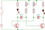

# Jugend Hackt Blink Badge

This is the first verison of a giveaway badge for jugend hackt.
It contains a simple oscillator circuit made up of basic electrical components.

</img>

The circuit is called an astable multivibrator and one LED-eye is the inverted output of the other eye.

With two potentiometers and a screwdriver, you can adjust, how long one eye will take till it gets switched off.

## How to assemble
The PCB contains footprints for two kinds of assembly:
1. Through Hole Technology

   Most of the parts can be put through the pcb, wich makes soldering easier.
   Beginners should take this way of assembly.
   
2. Surface Mount Technology

   Parts are layed on the surface of the PCB before soldering.
   Parts are smaller and can slip away while soldering. 
   This is more difficult to solder by hand. Recommended for advanced solderers or if you have an reflow oven.

### THT-version

#### Parts needed

#### Step 0:

#### Step 1:

#### Step 2:

#### Step 3:

#### Step 4:

#### Step 5:

### SMT-version
#### Parts needed

#### Step 0:

#### Step 1:

#### Step 2:

#### Step 3:

#### Step 4:

#### Step 5:

## PCB
The gerber design files are located in the 'production_files'-folder. If you don't want to customize the design, you only need to  send this folder to any manufacturer.

## Parts used
These are the parts used for the THT assembly.
| part | quanitity | vendor |
| ---- | :-------: | -----: |
| battery holder | 1 | [reichelt](https://www.reichelt.de/knopfzellenclip-fuer-20-mm-smd-kzh-20smd-p56574.html?&trstct=pol_3)|
| 47 Ohm resistor | 2 | [reichelt](https://www.reichelt.de/widerstand-kohleschicht-47-ohm-0207-250-mw-5-1-4w-47-p1431.html) |
| 4700 Ohm resistor| 2 | [reichelt](https://www.reichelt.de/widerstand-kohleschicht-4-7-kohm-0207-250-mw-5-1-4w-4-7k-p1425.html) |
| SPST style switch | 1 | [reichelt](https://www.reichelt.de/schiebeschalter-1x-um-stehend-print-rm-2-54-ss-esp101-p112178.html)|
| 500k trim pots | 2 | [reichelt](https://www.reichelt.de/einstellpotentiometer-liegend-500-kohm-9-mm-acp-9-l-500k-p110255.html)|
| 10µF caps | 2 | [reichelt](https://www.reichelt.de/elko-radial-10-uf-50-v-105-c-low-esr-fr-a-10u-50-p200268.html)| 
| LEDs | 2 | [reichelt](https://www.reichelt.de/led-5-mm-bedrahtet-rot-4-5-mcd-60-led-5mm-rt-p10233.html?&trstct=pos_0) |
| NPN Transistor EBC-pinout | 2 | [reichelt](https://www.reichelt.de/bipolartransistor-npn-300v-0-5a-0-625w-to-92-mpsa-42-p13112.html) |

The selected Transistor works, but i am not shure, whether it is the best fit.

For the SMT-version you need different packages:
1. Transistors in SOT-23
2. Resisros in 1206
3. LEDs and Caps in 0805
